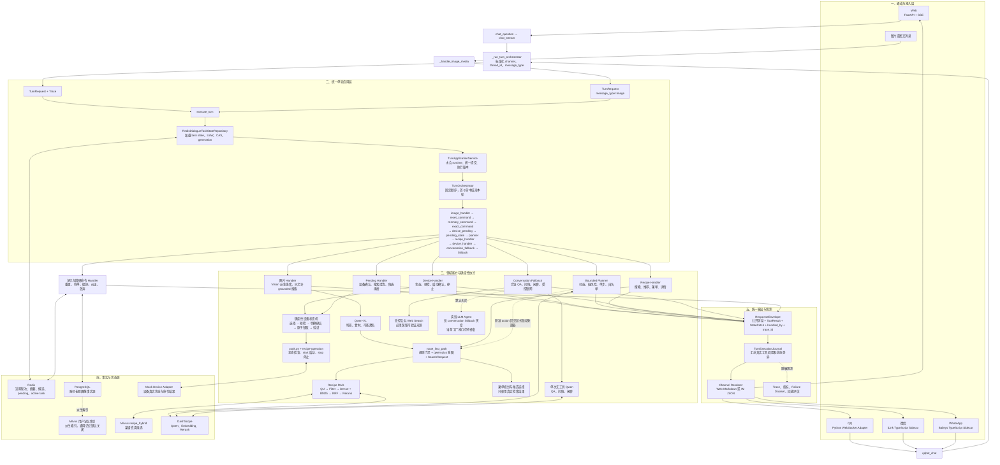

# CookClaw Agent 整体架构图

> 更新：2026-08-25  
> 代码基线：`main@f0642b7`  
> 范围：Web、QQ、微信、WhatsApp 的文本与图片请求。本文描述当前仓库主链，不把默认关闭的实验能力写成生产能力。

## 1. 一句话定位

CookClaw 当前是“统一 Turn Harness + 固定优先级领域 Handler + 受限模型能力”的混合架构，
不是让 LLM 自由发现工具、循环执行的开放式 Agent。LLM 负责意图、低风险规划和自然表达；
菜谱事实、记忆写入与设备副作用由确定性代码和真实数据源控制。

## 2. 整体架构图

## 3. 主链如何理解

1. 四个通道最终把文本统一交给 `_run_turn_orchestrator()`；图片通过同一个
   `TurnApplicationService` 的 `image_handler` 进入，不另建一套业务编排。
2. `TurnApplicationService` 在一个 task-state UoW 中加载状态、运行 Handler，并在结束时统一提交。
3. `TurnOrchestrator` 严格按固定顺序尝试 Handler；首个返回 `ResponseEnvelope` 的 Handler
   拥有本轮，后面的 Handler 不再执行。
4. Planner 即使开启，也只能输出受限的低风险单步 action；设备确认、启动、停止和记忆写入不授权给 Planner。
5. 菜谱搜索失败时不允许 QA 模型补造菜谱；设备结果未知时不允许自动重发副作用命令。
6. `ResponseEnvelope` 把业务结果和内部 `ToolResult`、`StatePatch` 分开，Renderer 只改变展示形态，
   不修改业务事实。

## 4. 调用链速查表

| 层 | 当前入口或关键函数 | 主要职责 |
|---|---|---|
| Web API | `app/api/routes/chat.py:chat_question` → `app/agent/participle_agent.py:chat_stream` | 校验请求、签发 Web thread、SSE 输出 |
| QQ | `app/main.py:_qqbot_message_handler` → `app/agent/participle_agent.py:qqbot_chat` | QQ 收发、身份隔离、媒体与展示适配 |
| 微信 | `app/main.py:_weixin_message_handler` → `qqbot_chat` | iLink sidecar 事件接入、共享文本主链 |
| WhatsApp | `app/main.py:_whatsapp_message_handler` → `qqbot_chat` | Baileys sidecar 事件接入、共享文本主链 |
| 图片 | `app/main.py:_handle_image_media` → `app/orchestrator/turn/image_handler.py` | Vision 派生事实、真实菜谱检索、候选保存 |
| Turn facade | `app/agent/participle_agent.py:_run_turn_orchestrator` → `app/orchestrator/turn/facade.py:execute_turn` | 构造 TurnRequest、注册本轮 Handler |
| 应用服务 | `app/orchestrator/turn/application_service.py:TurnApplicationService.handle` | task-state UoW、runtime 水合、统一提交与账本 |
| Handler 调度 | `app/orchestrator/turn/turn_orchestrator.py:TurnOrchestrator.handle` | 固定顺序、first-hit-wins |
| 意图与路由 | `app/orchestrator/router.py:route_fast_path` | 安全门禁、意图、上下文合并、领域分流 |
| 菜谱检索 | `app/agent/fast_path.py:_run_search_subprocess` → `app/agent/recipe_search_service.py:search` | 进程内检索优先，失败回退子进程 |
| RAG 内核 | `app/agent/skills/recipe-search/recipe_search.py:search_recipes` | QU、过滤、向量化、混合召回、重排、去重 |
| 设备执行 | `app/orchestrator/cook.py:execute_cook` → `recipe-operation/scripts/execute_recipe.py` | 状态复查、幂等上下文、start 启动和结果验证 |
| 状态与记忆 | `app/conversation/task_state_repository.py:RedisDialogueTaskStateRepository`、`app/conversation/service.py:ConversationService` | Redis 短期态/CAS，PostgreSQL 长期画像投影 |
| 输出 | `app/orchestrator/turn/response_renderer.py` | Envelope → Web Markdown / IM JSON |

## 5. 关键开关

| 开关 | 默认 | 影响 |
|---|---:|---|
| `TURN_PLANNER_MODE` | `off` | `off/shadow/active`；active 仍需通道、身份、灰度和 action 白名单 |
| `TURN_PLANNER_ACTIVE_ROLLOUT_PERCENT` | `0` | Planner active 稳定分桶比例 |
| `CONVERSATION_DEEP_AGENT_ENABLED` | `false` | 只读候选选择/推荐表达能力，不拥有整轮或设备副作用 |
| `IMAGE_DEEP_AGENT_ENABLED` | `true` | 图片候选的受控组织能力，不开放设备写操作 |
| `LLM_AGENT_ENABLED` | `false` | 实验 LLM-centric conversation fallback；不是当前稳定主链 |
| `LLM_AGENT_ROLLOUT_PERCENT` | `0` | 实验 LLM Agent 灰度比例 |
| `RECIPE_SEARCH_INPROCESS` | `1` | 优先使用进程内常驻检索；失败时回退独立子进程 |
| `CONVERSATION_PROFILE_MEMORY_ENABLED` | `true` | 明确称呼等画像记忆；还受通道和灰度约束 |
| `CONVERSATION_GENERAL_MEMORY_ENABLED` | `false` | 职业、习惯、目标等通用长期事实链 |

当前本地 `.env` 只显式设置了 `RECIPE_SEARCH_INPROCESS=1`；其余能力需按代码默认值理解，
不能据此推断服务器部署配置。

## 6. 已知坑与红线

- **Handler 顺序以代码为准**：当前是 `device_pending → pending_state → planner`。旧文档中
  `device_pending → planner → pending_state` 的顺序已过时；已有业务 pending 必须先于 Planner。
- **实验 LLM Agent 当前不可当成已接通**：`agent_factory.py` 依赖
  `app.agent.recipe_search_service.RecipeSearchService`，但当前检索服务公开的是模块级
  `search()` / `warmup()`；默认关闭避免它阻断主链，接口修复和回归前保持“待确认”。
- **禁止编造菜谱**：名称、ID、图片、食材和标签只能来自真实 Milvus 结果或已保存候选。
- **设备副作用必须确定性执行**：明确确认、真实设备状态、原子 action claim、幂等与结果验证
  缺一不可；超时或 unknown 不自动重发。
- **Runtime Memory 是只读投影**：Redis task state 和 PostgreSQL 画像才是持久事实源，不能从
  助手自然语言回复反推候选、选择或设备状态。
- **测试不等于外部验收**：本图只说明当前代码结构；四通道登录、真实 Milvus/Qwen、Redis/PG
  故障注入和物理设备 E2E 仍需按部署环境验证。

## 7. 验证入口

- `/api/v1/health`：确认 `turn_mode=unified`、Planner 模式和模型配置。
- Turn Trace：检查 `handled_by`、真实 `tool_results`、`state_patches` 和 fallback code。
- Failure Dataset：至少回放换题污染、搜索失败不编造、重复设备确认、命令结果 unknown、
  不同通道 thread 隔离和图片识别纠正。
