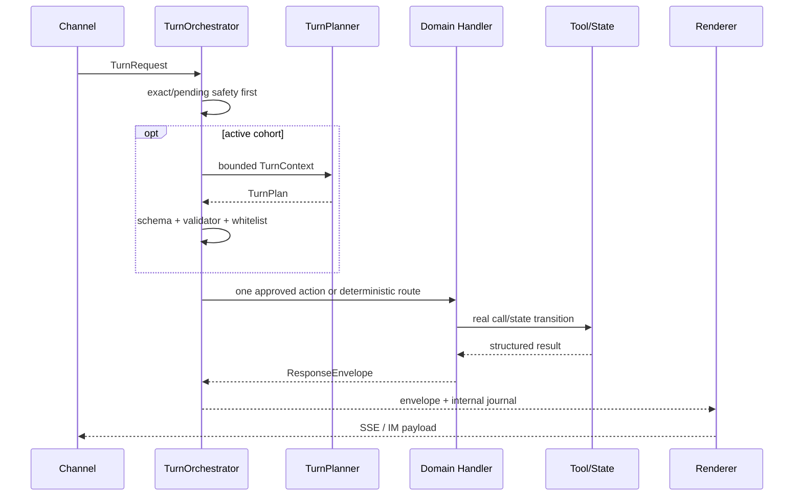
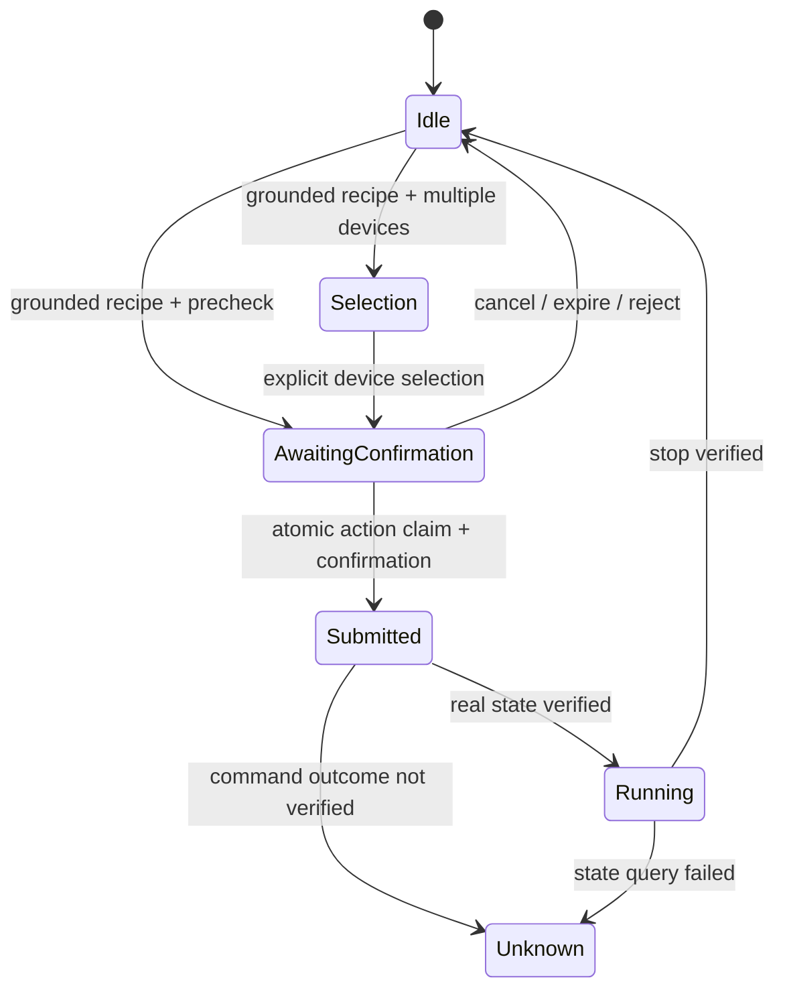

# 01. Agent Architecture

> 当前快照：2026-08-25
> 一页整体图见 [`00-Agent-Overall-Architecture-Map.md`](00-Agent-Overall-Architecture-Map.md)，详细系统设计见 [`../architecture.md`](../architecture.md)。

## 1. 当前架构判断

CookClaw 不是开放式“LLM 自由发现工具并循环执行”的 Agent。当前主链是：

> Channel Adapter → Turn Orchestrator → Bounded Planner（可选）→ 显式领域 Handler →
> 真实工具/状态 → ResponseEnvelope → Channel Renderer

职责分配：

- Planner 理解上下文并建议一个低风险下一步；
- Validator 和 Executor 决定该建议是否可执行；
- Recipe/Device/Memory Handler 拥有业务执行权；
- Milvus、Mock Device Adapter、Redis/PostgreSQL 是事实源；
- 设备启动、停止和确认只属于确定性状态机；
- 表达模型只根据已提供事实组织回复。

阶段 5.1 已删除旧 Web/IM `create_deep_agent` 对象、`MemorySaver`、通用 shell/skills
backend、旧总 Prompt 和旧 runtime memory 指令。当前仍存在的
`controlled_deep_agent.py` 是独立的只读候选/推荐能力，不是整轮流程所有者。

代码只有一个编排根：`app/orchestrator/`。其中 `turn/` 拥有单轮应用生命周期、固定
Handler 顺序、Adapter、Renderer 和账本；`planning/` 只拥有受限规划、校验、单步执行及
Shadow；根目录其他模块承载路由、菜谱、候选、菜单和设备领域策略。
`app/conversation/` 仅实现会话记忆、长期画像、运行时快照和任务态存储/Repository，
不决定 Handler 顺序、意图路由、工具调用或回复内容。

## 2. 统一文本主链

Web、QQ、微信和 WhatsApp 文本无条件进入同一个 `_run_turn_orchestrator()`，再由
`app/orchestrator/turn/` 完成单轮生命周期：

```text
image_handler（纯文本跳过）
→ reset_command
→ memory_command
→ exact_command
→ device_pending
→ pending_state
→ planner
→ recipe_handler
→ device_handler
→ conversation_fallback
→ fallback
```

规则：

1. 首个返回 `ResponseEnvelope` 的 Handler 结束本轮；
2. Memory、Recipe、Device 返回结构化领域结果；
3. `TurnExecutionJournal` 汇总真实 Tool Trace 和状态差异；
4. Web 与 IM Renderer 只做通道表达，不改变业务事实；
5. `conversation_fallback` 仅承载 QA、问候、闲聊和联网搜索，是统一序列内部 Handler，不是第二条主链；
6. 所有通道共享同一应用服务与状态 UoW，健康检查固定报告 `turn_mode=unified`。



## 3. 图片主链

图片不是伪造的用户文本；标准化后由同一 TurnApplicationService 的首个
`image_handler` 接管：

```text
媒体输入
→ Vision recognition
→ DerivedTurnContext(source=vision)
→ 同一 TurnPlanner/Validator（命中 active 时）
→ 仅 recipe.search / recipe.recommend Executor
→ SearchRequest
→ 真实 Milvus
→ ResponseEnvelope
```

视觉派生事实是可纠正观察值，不是用户承诺。图片 Executor 不注册设备、联网、记忆或任意
工具动作；纯图片可以有空 `utterance`。

## 4. Bounded Planner

### 4.1 输入

`TurnContext` 只包含当前任务需要的裁剪信息：

- 本轮 utterance 和消息类型；
- pending、active cooking、选中/焦点；
- 有上限的真实候选引用；
- 当前约束、稳定偏好和少量近期用户轮；
- Planner capabilities；
- 可选的带来源派生事实。

### 4.2 输出

`TurnPlan` 使用固定 schema、phase、reply act 和 evidence refs。当前 action registry：

```text
conversation.respond / conversation.clarify
recipe.search / recipe.recommend / recipe.detail
candidate.select / candidate.compare / candidate.restore_previous
menu.plan
device.prepare / device.status
web.search
```

永不提供：

```text
device.start / device.stop / device.confirm / memory.write
filesystem / shell / code execution / subagent / arbitrary tool
```

### 4.3 执行门禁

```text
TurnPlanner
→ Pydantic schema
→ PlanValidator
→ deterministic handoff
→ single-step limit
→ configured action whitelist
→ utterance compatibility guard
→ explicit BoundedPlanExecutor handler
```

Planner `confidence` 不参与授权。Planner query 不能覆盖用户原话中的菜名、食材、排除项
或设备证据。

### 4.4 失败语义

- Planner 调用/解析/校验失败且无影响：同一个确定性链最多接管一次；
- 已有工具调用或状态变化后失败：`failed_closed`，不重跑旧链；
- exact 高风险命令：Planner 之前由确定性 Handler 接管；
- `device.prepare` 最多建立选择/确认态，不启动设备；
- Shadow 使用隔离 Context，不修改当前回复、工具次数或状态。

## 5. 领域所有权

| 领域 | 所有者 | Planner 权限 |
|---|---|---|
| 菜谱搜索/推荐/菜单 | Recipe Handler + Milvus | 可建议 search/recommend/menu；不能生成候选事实 |
| 候选详情/选择 | Recipe Handler + 已保存真实候选 | 只能引用 Context 中真实 ID/序号 |
| 设备状态 | Device Handler + Mock Device Adapter | 可建议只读 status |
| 设备预检 | Device Handler | 可建议 prepare；不能确认或启动 |
| 启动/停止 | 确定性 pending/active 状态机 | 无 action、无写权限 |
| 记忆 | Memory Handler + Redis/PostgreSQL | 无写/删 action |
| 联网事实 | WebSearch Handler | 必须有用户原话证据和可验证来源 |
| 闲聊/QA | 单次无工具模型 | 只生成文本 |

## 6. 状态模型

| 状态 | 当前事实源 | 说明 |
|---|---|---|
| 候选、pending、active task | Redis 独立 `task-state:<thread_hash>` | 独立 revision/generation，跨 worker 事实源 |
| 单轮同步工作区 | `TurnScopedDialogueStatePort` → `app/conversation/task_state_workspace.py` | 随机内部 key，turn 退出即清理 |
| 同步状态语义 | `DialogueStatePort` → `task_state_workspace.py` | 只提供状态操作，不拥有跨轮事实或编排权 |
| 近期轮次和摘要 | Redis ConversationStore | 会话级 |
| 称呼和长期偏好 | PostgreSQL ProfileStore | 账号级、版本控制 |
| 设备真实状态 | Mock Device Adapter | 状态未知时不得假设成功 |

Web 由服务端签发 `web:<32hex>` 高熵 thread 并通过 `X-CookClaw-Thread-Id` 返回；客户端必须后续把它当匿名 session bearer 复用。该 session 可保存短期 transcript 与任务态，但不等于登录账号，也不能自动获得跨会话画像。

## 7. 设备状态机



同一 `action_id` 通过 Redis 原子领取；网络超时后不自动重发启动/停止。无 active task 时
不得向默认设备发送 stop。账号—设备商业化 ACL 尚未完成，是生产前 P0。

## 8. Prompt 与 Agent 实际状态

| 能力 | 当前状态 |
|---|---|
| Turn Planner Prompt | 在线可用；默认 off，shadow/active 共用 |
| Intent Prompt | 在线按需使用 |
| Response Style | 推荐、QA、问候、闲聊等共享 |
| Controlled Deep Agent | 默认关闭或定向灰度；只读候选/详情工具 |
| Vision Prompt | 图片时使用；只产检索线索 |
| Query Understanding | 默认关闭 |
| 标签/翻译 Prompt | 仅离线 |
| 旧 Web/IM 总 Prompt | 已删除 |
| 通用 shell/skills Agent | 已删除 |

在线 Prompt 以 `app/core/*_prompt.md`、Planner 实现和各领域 Handler 中的受控模板为准；
文档只描述职责边界，不复制可能漂移的完整 Prompt 内容。

## 9. 核心配置

| 配置 | 默认 | 作用 |
|---|---:|---|
| `TURN_PLANNER_MODE` | `off` | `off/shadow/active` |
| `TURN_PLANNER_MODEL` | 继承 Intent 默认 | Planner 模型，不授权副作用 |
| `TURN_PLANNER_TIMEOUT_SECONDS` | `8` | Shadow/Active 单次调用超时 |
| `TURN_PLANNER_ACTIVE_ROLLOUT_PERCENT` | `0` | 稳定用户分桶 |
| `TURN_PLANNER_ACTIVE_ACTIONS` | 封闭集合 | Executor 二次白名单 |
| `CONVERSATION_DEEP_AGENT_ENABLED` | `false` | 受控候选/推荐能力 |
| `CONVERSATION_TRACE_ENABLED` | `true` | 脱敏每轮 Trace |
| `CONVERSATION_TRACE_JSONL_PATH` | 空 | 可选独立 JSONL |

## 10. 回滚

- 只关闭 Planner：`TURN_PLANNER_MODE=off`；
- 关闭受控 Agent：`CONVERSATION_DEEP_AGENT_ENABLED=false`；
- 检索回退：按需关闭进程内或混合检索开关。

配置修改后必须重启并检查 `/api/v1/health`。回滚不会撤销已发送设备命令；结果 unknown
时必须先查询真实状态。统一 Turn 主链没有运行时双链开关；整体回退必须发布已验证代码版本。

## 11. 当前待确认

- 测试服务器 active Planner 的自然度、正确率、token 和 P95；
- 四通道真实登录、媒体和终端渲染；
- Redis 多 worker、TTL 和故障注入；
- 真实设备 action、重复确认、start/stop 和 unknown；
- 账号—设备 ACL、审计和撤权；
- `conversation_fallback` 内的 QA、问候、闲聊和联网搜索何时进一步拆成独立领域 Handler。
