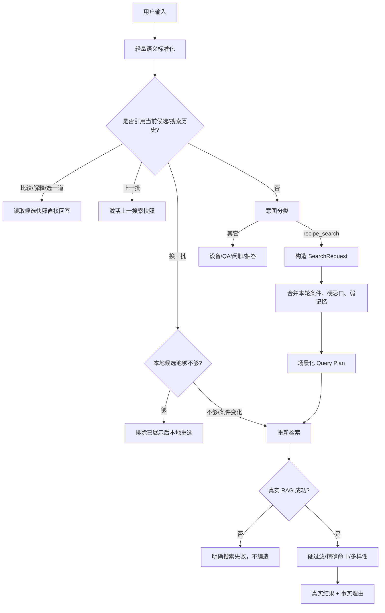

# 04. Search Rule Specification

## 1. 当前搜索决策（AS-IS）



## 2. 什么时候直接回答

以下场景 SHOULD 不调用 RAG：

- 用户问的是最近候选的区别、食材、风格或推荐理由；
- 用户要求从当前候选中选一道；
- 用户说“上一批”，且有已保存快照；
- 用户询问通用烹饪技巧、食材替换、火候或保存方法；
- 纯问候、感谢、纠错、身份或领域边界问题；
- 设备状态、确认、取消、停止和进度由设备工具处理，不属于 RAG。

## 3. 什么时候必须搜索

以下场景 MUST 调真实 RAG：

- 用户要新的菜谱、推荐或某道菜的做法；
- 用户提供食材、口味、菜系、餐次、人数等，希望得到菜谱候选；
- 图片识别得到菜名/食材后，需要给出可执行菜谱；
- 用户要求换一批，本地候选池不足或新增条件改变检索请求；
- 执行意图中提到明确菜名但当前候选不存在：先搜到真实候选，不能直接构造 cookId。

## 4. 什么时候追问

只在缺失信息会实质改变结果时追问一个问题：

- “帮我安排一下”且没有任何近期上下文、食材或场景；
- 用户同时给出冲突硬条件，例如“纯素牛肉”；
- 指代对象不清且没有候选快照，例如“就做那个”；
- 用户要求设备操作但无法确定设备或授权关系；
- 图片识别不到食物或置信过低。

模糊但可逆的推荐请求（如“想喝汤”）可以直接搜索，不必为了收集完整槽位拖慢体验。

## 5. Query Rewrite 规范（TO-BE）

当前有五层不同程度的改写：`semantic_rewrite`、Intent 结构化、`SearchRequest` 规则修正、`plan_search_query`、RAG 内部 QU。目标应收敛为一份可审计协议。

### 5.1 标准结构

```json
{
  "raw_text": "对比一下这三个菜哪知道最省事，我怕麻烦",
  "normalized_text": "对比一下这三道菜哪一道最省事，我希望步骤简单",
  "context_action": "compare_candidates",
  "search_needed": false,
  "search_request": null,
  "changes": [
    {"type": "candidate_group_reference", "from": "三个菜", "to": "三道菜"},
    {"type": "asr_typo", "from": "哪知道", "to": "哪一道"},
    {"type": "effort_preference", "from": "怕麻烦", "to": "希望步骤简单"}
  ]
}
```

### 5.2 改写允许做什么

- 修正确定无歧义的 ASR/输入法错误；
- 统一候选指代和序号；
- 把口语软要求映射为标准槽位，例如“怕麻烦”→ `avoid=复杂步骤`；
- 去掉寒暄但保留所有正向、负向和场景约束；
- 识别“上一批/这三道/第一个”等上下文动作；
- 记录每项变化，保留原文用于审计。

### 5.3 改写禁止做什么

- 不得生成用户没说过的菜名、食材、菜系、忌口或健康目标；
- 不得把“麻烦”解析成“麻辣”；
- 不得把历史牛肉、辣味等弱线索拼入明确的“汤/杭州菜”等当前方向；
- 不得把软要求当硬过敏原；
- 不得把“减肥的人适合哪一道”改成一次新的“减肥菜谱搜索”。

## 6. SearchRequest 规则

### 6.1 槽位

`dish / ingredient / cuisine / flavor / method / scene / meal / diet / exclude / avoid / soft_preferences / party_size / result_limit`

### 6.2 优先级

```text
本轮硬排除和过敏
  > 本轮明确菜名/主料/菜系
  > 本轮口味、做法、餐次和场景
  > 长期素食等安全边界
  > 泛推荐时的长期偏好/现有食材
  > 最近真实搜索或开火行为的弱线索
```

### 6.3 结果数量

- 用户明确数量优先，范围 1–10。
- 未明确时：1–2 人 3 道；3–4 人 4 道；5–6 人 6 道；7–8 人 8 道；更多最多 10 道。
- 召回池应大于展示数，为硬过滤、多样性和换一批留空间。

## 7. 搜索结束条件

一次搜索在满足以下条件时结束：

1. 真实检索返回成功；
2. 硬忌口已二次过滤；
3. 结果完成质量过滤、菜名精确优先和多样性选择；
4. 展示内容只使用真实字段；
5. 候选及候选池已写入当前会话快照；
6. 回复告诉用户每道的事实差异和一个自然的下一步。

## 8. 空结果与失败

| 状态 | 处理 |
|---|---|
| 检索成功、0 结果 | 说明条件可能过窄；建议只放宽一个条件 |
| 硬过滤后 0 结果 | 不恢复违反忌口的候选；明确“安全条件下没有结果” |
| Rerank 失败 | 使用原始混合召回顺序，并记录降级 |
| 进程内检索失败 | 自动回退子进程 |
| 两条检索路径都失败 | 返回搜索服务异常；保留 SearchRequest 便于原话重试 |
| 换一批没有新菜 | 不重复旧菜凑数；请用户放宽一个条件 |

`apply_search_plan()` 对 blocked terms 采用 fail closed：过滤后为空就保留空集，不为凑结果
恢复被排除候选。过敏/忌口仍需由 `SearchRequest` 的前后置硬过滤共同保护。

## 9. 拒答与设备边界

- 非烹饪请求不搜索。
- 医疗诊断不搜索菜谱替代医疗建议；只能给保守饮食边界。
- 搜索结果不能自动执行设备。
- 只有真实候选中的 `recipe_id` 才可进入设备状态机。
