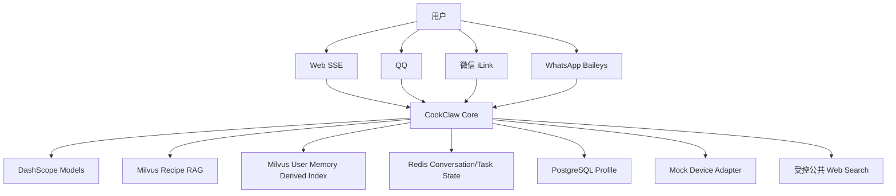
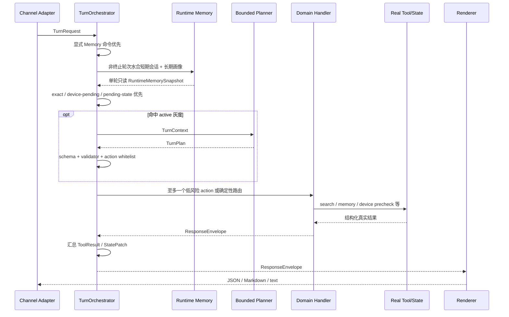
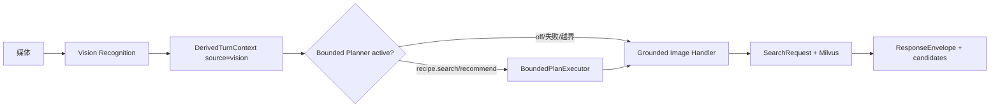
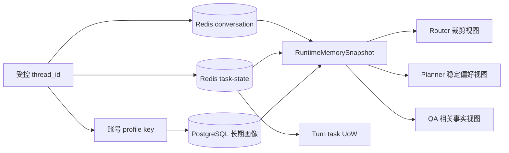
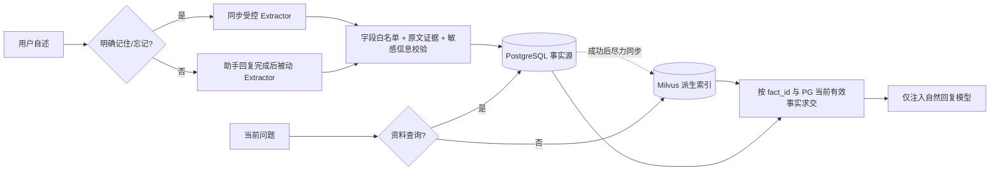
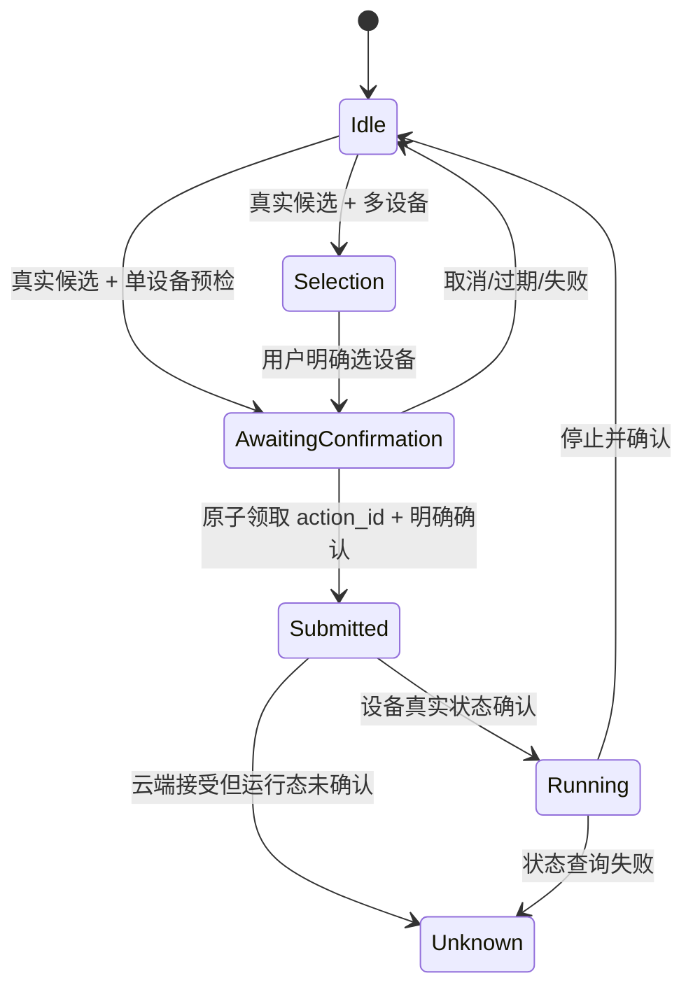

# CookClaw 当前架构

版本日期：2026-08-25
适用基线：`main@f0642b7`

本文描述当前代码真实运行链。历史 DeepAgents 双 Agent、`MemorySaver`、通用 shell
和 Skill 自动路由已经从主模块删除；如果其他旧文档与本文冲突，以代码和本文为准。

## 1. 架构结论

CookClaw 使用“受约束智能 + 确定性执行”的混合架构：

- LLM 负责意图理解、低风险单步规划和自然表达；
- 领域 Handler 拥有搜索、记忆、设备和状态的执行权；
- 菜谱事实来自 Milvus 或已核验的 Mock Device 详情；
- 设备副作用只属于确定性状态机；
- 通道只负责输入标准化、身份隔离和渲染/发送；
- 每轮通过 `ResponseEnvelope + ToolResult + StatePatch + Trace` 可回放。

它不是开放式 ReAct 循环，也不是 OpenClaw 式任意 Skill 自主执行。这样保留对话规划的
流畅感，同时把事实、权限、幂等和设备安全控制在代码边界内。

## 2. 系统上下文



外部依赖边界：

| 依赖 | 事实职责 | 失败策略 |
|---|---|---|
| DashScope | 意图、Planner、QA、视觉、Embedding、Rerank | 超时/解析失败按领域 fail closed |
| Milvus 菜谱集合 | 菜谱名称、ID、图片、食材、标签等结构化事实 | 进程内失败可回退子进程；整体失败不生成菜谱 |
| Milvus 用户记忆集合 | 通用画像事实的用户内语义召回派生索引 | 失败退回 PostgreSQL 当前事实；它不是事实源 |
| Redis | 活跃对话、候选、pending 和设备任务态 | required 模式启动失败；运行期不得声称已写入 |
| PostgreSQL | 长期账号画像与通用画像事实的唯一事实源 | 版本冲突/失败明确记录，不伪装成功 |
| Mock Device Adapter | 设备状态、真实详情、启动和停止 | 保留 accepted/running/unknown 三态，不自动重发副作用 |
| 公共搜索 | 时效性公开信息及来源 | 无可验证来源时拒绝补全 |

## 3. 统一 Turn 主链

### 3.1 文本与语音转写文本



`app/orchestrator/turn/turn_orchestrator.py` 的固定 Handler 顺序为：

1. `image_handler`：图片/混合媒体的视觉派生事实与 grounded 菜谱链；纯文本时跳过；
2. `reset_command`：新对话、清除全部记忆等代际重置；
3. `memory_command`：称呼、偏好、纠正、清除等显式记忆命令；
4. `exact_command`：身份、放弃等无需模型判断的动作；
5. `device_pending`：选设备、确认、取消等高风险状态；
6. `pending_state`：搜索澄清、候选追问和非设备待答；
7. `planner`：命中 active 灰度的低风险单步；已有业务 pending 必须先处理；
8. `recipe_handler`：搜索、推荐、菜单、详情和事实安全失败；
9. `device_handler`：状态、预检、进度和停止；
10. `conversation_fallback`：QA、问候、闲聊和联网搜索；它是统一序列内部 Handler，不是第二条主链；
11. `fallback`：所有前置 Handler 均未处理时的受控兜底。

首个返回 `ResponseEnvelope` 的 Handler 结束本轮。Handler 不得发送通道消息；Renderer
不参与业务决策。

### 3.2 图片

图片下载/读取属于通道前处理，视觉结果不是用户原话；标准化后由统一 Turn 主链首个
`image_handler` 接管：



`DerivedTurnContext` 只含场景、媒体数量、食材和可能菜名，不含图片 URL、文件路径或
鉴权信息。Planner Trace 只记录来源和数量，不记录识别值。图片 Executor 不注册任何
设备 action。

## 4. 分层和代码所有权

`app/orchestrator` 是唯一编排根，不再存在与它平级的第二套编排包。根目录按职责拆成：

- `app/orchestrator/turn/`：单轮应用服务、Handler 顺序、运行协议、Adapter、Renderer 与执行账本；
- `app/orchestrator/planning/`：受限 Planner、schema、校验、单步执行、灰度和 Shadow 评估；
- `app/orchestrator/*.py`：意图、路由、SearchRequest、候选、菜单和设备等领域策略。

`app/conversation/` 只提供会话记忆、长期画像、运行时记忆快照、任务态存储与
Repository。它不决定 Handler 顺序、意图路由、工具调用或回复内容，因此不是第二个编排层。

| 层 | 所有权 | 主要代码 | 禁止承担 |
|---|---|---|---|
| Channel | 收发、身份、媒体、通道能力 | `app/main.py`、`app/{qqbot,whatsapp,weixinbot}` | 意图、搜索、设备业务决策 |
| API | HTTP 校验、SSE、Web session | `app/api/routes/chat.py` | 领域状态和工具执行 |
| Turn Application | Turn 协议、UoW 生命周期、Handler 顺序、Adapter、Renderer、账本 | `app/orchestrator/turn/` | 通道 SDK、持久化实现、自由动态工具发现 |
| Planning | 受限规划、校验、单步执行和 Shadow | `app/orchestrator/planning/` | 设备副作用、任意工具发现 |
| Domain | 意图、SearchRequest、候选、菜单和设备状态机 | `app/orchestrator/*.py` | 通道发送、会话存储实现 |
| Model/Expression | 单次意图/QA/表达和受控 Agent | `app/agent/` | 未授权设备副作用、编造工具事实 |
| RAG | 召回、过滤、重排、数据迁移 | `app/agent/skills/recipe-search/` | 用户权限和设备状态 |
| Conversation State | Redis 会话/任务态、PG 画像、运行时快照及 Port 实现 | `app/conversation/`、`app/ports/` | 编排顺序、意图路由、工具选择、回复措辞 |
| Device | 真实详情、状态、启动、停止 | `app/orchestrator/cook.py`、`recipe-operation/` | Planner 自主调用 |
| Presentation | Envelope → 通道能力 | `app/orchestrator/turn/response_renderer.py`、`app/main.py` | 修改业务事实 |
| Observability | Trace、汇总、告警 | `app/observability/`、`scripts/summarize_*` | 记录敏感正文 |

## 5. 稳定运行协议

### 5.1 TurnRequest

定义：`app/orchestrator/turn/runtime_models.py`

核心字段：

```text
schema_version / utterance / thread_id / channel / message_type / trace_id
derived_context?
```

`utterance` 与 `thread_id` 在 repr 中隐藏；`context_ref()` 只输出字符数、通道、消息类型
和是否存在 Trace。

### 5.2 TurnContext

定义：`app/orchestrator/planning/models.py`，由
`app/orchestrator/turn/context_loader.py` 构造。

Planner 只获得本轮所需裁剪信息：

- 当前消息和消息来源；
- pending、active cooking 和当前任务；
- 最多 10 个候选引用及选中/焦点；
- 当前约束、稳定偏好和最多 4 条近期用户轮；
- 显式 action capabilities；
- 可选的带来源派生事实。

`planner_payload()` 可发送值给模型；`context_ref()` 仅输出计数和布尔形状，两者不可混用。

### 5.3 TurnPlan

Planner 只能输出固定 schema、固定 phase 和固定 action。每个 step 必须给 evidence ref；
confidence 只用于分析，不授权执行。

当前 action 包括对话、菜谱、候选、菜单、设备预检/状态和公共搜索；不包括：

```text
device.start / device.stop / device.confirm / memory.write
filesystem / shell / subagent / arbitrary tool
```

### 5.4 ResponseEnvelope

核心层统一返回：

```text
response_type / intent / lang / message / data / extra_fields
tool_results / state_patches / handled_by / trace_id
```

`tool_results`、`state_patches` 和 trace 永不进入终端用户 payload。`channel_payload` 是
现有 IM JSON 公共协议的原始载荷，不代表第二条执行路径，且只允许在 Adapter 边界解析一次。

## 6. Bounded Planner

### 6.1 模式

| 模式 | 行为 |
|---|---|
| `off` | 完全不调用 Planner |
| `shadow` | 确定性基线完成后旁路评估；不阻塞、不调用业务工具、不写状态、不发送回复 |
| `active` | 还需命中通道、账号/稳定分桶和 action 白名单，才进入单步执行 |

active 执行链：

```text
TurnPlanner
→ Pydantic schema
→ PlanValidator
→ deterministic handoff 检查
→ 单步限制
→ action 配置白名单
→ 领域语义兼容护栏
→ BoundedPlanExecutor 显式 handler
```

Planner 参数不能覆盖用户原话中的菜名、食材、忌口或设备动作证据。联网、设备状态和
设备预检还需原话语义护栏；普通闲聊不能被 Planner 升级成工具调用。

### 6.2 失败策略

- Planner 调用/解析/校验失败且没有工具或状态影响：进入同一个确定性 Handler 一次；
- 执行已发生工具调用或状态变化后失败：fail closed，不允许旧链再跑；
- 高风险计划：交回确定性 Handler；
- `device.prepare` 最多形成设备选择/确认态，不启动设备；
- Shadow 使用隔离 Context，不计入主轮模型和工具数量。

## 7. 菜谱 RAG

### 7.1 数据链

```text
原始 Excel
→ normalize facets
→ recipe_collection dense 基线
→ recipe_hybrid dense + BM25
→ RRF
→ gte-rerank-v2
→ 硬过滤 / 精确菜名 / 软偏好 / 食材覆盖 / 多样性
→ 真实候选
```

默认检索入口 `app/agent/recipe_search_service.py` 是进程内 warm 单例；
`app/agent/fast_path.py:_run_search_subprocess()` 是兼容名称，先走进程内服务，失败再走
独立技能 `.venv` 子进程。

`SearchRequest` 统一承载菜名、食材、口味、忌口、语言、人数、菜单范围和任务操作。
当前请求硬约束优先于长期偏好；过敏冲突必须在检索前/后双重阻断。

Milvus Lite 注意事项：

- 稀疏列使用 `SPARSE_INVERTED_INDEX`；
- BM25 集合单次 insert，避免跨 segment compaction 问题；
- 迁移后 load 并执行一次 sparse 查询；
- `RECIPE_SEARCH_CONCURRENCY=1`；
- 本地路径配置名是 `RECIPE_MILVUS_URI`。

## 8. 对话与任务状态

### 8.1 状态分层

| 状态 | 事实源 | 说明 |
|---|---|---|
| 当前候选/pending/active/device execution | Redis 独立 `task-state:<thread_hash>` | 独立 revision + generation；设备确认原子迁移为 durable execution，不与聊天历史共用冲突域 |
| 单轮同步工作区 | `app/conversation/dialogue_state_workspace.py:TurnScopedDialogueStatePort` | 随机内部 key，退出 turn 即清理，不是跨轮事实源 |
| 同步状态语义 | `WorkspaceDialogueStatePort` → `task_state_workspace.py` | conversation 内部 adapter；仅提供状态操作，不拥有跨轮事实，也不参与编排 |
| 近期轮次/摘要/搜索历史 | Redis ConversationStore | 会话级 |
| 单轮运行时记忆 | `RuntimeMemorySnapshot` | Redis 短期隔离副本与 PG 长期当前投影；仅本轮共享，不是新事实源 |
| 称呼/长期偏好 | PostgreSQL ProfileStore | 账号级、带版本控制 |
| 职业、家庭、习惯、目标等通用画像事实 | PostgreSQL `channel_users.long_term_memory.facts` | 当前有效值的唯一事实源 |
| 通用画像语义索引 | Milvus `cookclaw_user_memory_v1` | PG 派生数据，可删除、可重建、不可单独作为回复事实 |
| 设备真实状态 | Mock Device Adapter | Redis active 过期后必须重查 |

Turn 应用服务和领域 Handler 通过 `app/ports/task_state.py` 与
`app/ports/dialogue_state.py` 访问单轮 UoW，不直接依赖
`app/conversation/task_state_workspace.py`。正常退出一次 strict CAS 提交，异常退出丢弃
半轮工作区；Repository 和存储实现仍归 `app/conversation/` 所有。

### 8.2 隔离

- QQ：通道 + 聊天 + 用户；
- 微信：通道 + bot account + 用户；
- WhatsApp：私聊用户或群 + 成员；
- Web：服务端生成/回传 128-bit 高熵 `X-CookClaw-Thread-Id`；客户端后续把它当匿名 session bearer 复用，低熵自定义 ID 会被拒绝；
- Web 输入不能进入 QQ/微信/WhatsApp 命名空间。

画像和设备授权是不同边界；记住用户偏好不等于获得设备控制权。

### 8.3 新会话运行时水合

对可可靠识别账号的 IM thread，显式 Memory 命令未终止本轮后，
`ConversationService.load_runtime_memory()` 构造一次 `RuntimeMemorySnapshot`，并挂到
`_QQTurnRuntime.memory_snapshot`：



- IM 的 Redis conversation 无记录表示新短期会话，但不会阻止加载同一账号的 PostgreSQL 长期画像；匿名 Web 持久化同一高熵 thread 的 transcript 与 task state，但长期画像固定为 `unsupported`；
- 快照只读且仅存活一轮，不创建新 Redis key，也不把长期资料复制回 Redis；
- conversation 与 task key 分开读取，但整轮复用同一份已标注状态的快照；task 读取 `unavailable/invalid` 时丢弃 conversation 兼容镜像并 fail closed；
- PG 清除时间与删除/过期墓碑会屏蔽旧 Redis thread 的陈旧偏好；清除后只接受用户本轮重新明确表达的临时覆盖；
- 短期和长期读取分别报告 `loaded/new/empty/unavailable/invalid/unsupported`，故障或损坏资料不能伪装成空记忆；
- “新对话/清除全部记忆”是 UoW 内的第一个业务 Handler，在后续 Router/Planner/回复水合前，用一个 Redis Lua 原子推进 conversation/task generation；
- `active_search_request` 使用自身 `active_search_updated_at` 计算 6 小时语义 TTL，无关 task patch 不得续期；读到过期 pending 只做语义隐藏，读路径不删除可能已被并发更新的字段；
- 长期画像不可读时，文本和图片菜谱搜索/推荐都不会把未知过敏与忌口当成空集合；用户需先明确本次饮食安全事实，随后才能继续真实检索；画像可读时，图片结果同样执行账号过敏/忌口硬过滤；
- 清除与重置先跨过该 thread 已入队的异步 turn/profile 写链，再写清除标记或新会话快照，避免旧队列在响应后复活资料；
- Router、Planner、问候、推荐和 QA 复用同一快照，避免同一轮多次画像读取产生版本漂移；
- 快照先投影成冻结的 `SafetyMemoryView / PlannerMemoryView / QAMemoryView`；确定性服务层完成墓碑、清除边界和本轮纠正后，消费者只能读取 `effective_*` 结果；
- `routing_context(scope="preferences|route|full")` 作为稳定兼容门面保留；Planner 与 QA 主链直接使用类型化视图；
- 已加载为空与未提供、读取失败是三种不同状态；空集合不得触发旧上下文回退，兼容字典也必须是隔离副本；
- Planner 只看到稳定饮食偏好，职业、家庭、兴趣等通用事实只在相关 QA 中受控使用；
- thread、user ID 和记忆正文不进入 Trace 或运行时对象默认 `repr`；设备状态机不读取画像来授权副作用。

### 8.4 通用长期画像



执行边界：

- Extractor 是一次性、无工具、严格 JSON 调用；模型只能提出候选，不能直接写库；
- 密码、密钥、联系方式、精确地址和服务器连接信息在调用 Extractor 前拒绝；候选还必须命中字段白名单，并能在本轮用户原文中找到证据；
- 称呼、饮食偏好/过敏和设备状态继续由原确定性模块拥有，通用画像不得重复写入；
- 明确“记住/忘记”先同步提交 PostgreSQL，再用一次 Qwen 生成自然确认；PG 未成功时禁止声称已记住；
- 普通自述在助手回复后被动提取，不能改变当前轮回复，也不向用户虚假承诺保存结果；
- “你还记得我是谁吗”等资料查询直接读取全部当前 PG 事实；普通聊天先按当前问题从 Milvus 做用户内召回，再按 fact ID 与 PG 求交；索引异常时降级为 PG 最近事实；
- Milvus 只保存匿名 `profile_hash`、`fact_id`、分类、规范文本、更新时间和向量，不保存原始 thread、通道用户 ID、证据原句或鉴权值；
- 召回结果只进入 QA/闲聊表达上下文，不进入 Planner payload、`SearchRequest`、设备权限或设备确认状态；
- `scripts/reindex_user_memory.py` 可从 PostgreSQL 当前有效事实重建整个派生索引。

## 9. 设备状态机



关键规则：

- 多设备选择和最终启动必须分两轮；
- 同一 `action_id` 通过 Redis Lua 只能领取一次；
- 本地 claim 会原子生成 durable `device_execution`，并用 `action_id/msg_id` 阻止未决执行重复下发；Mock Device 是否支持按 `msg_id` 幂等与事后查询仍待真实接口契约确认，因此当前不宣称设备外部效果 exactly-once；
- 网络超时后不自动重发 `start/stop`；
- API 接受不等于设备已运行；
- 无活跃任务不得停止默认设备；
- 设备账号、权限和目标映射尚属商业化前 P0 验收项。

## 10. 通道与渲染

四个文本通道共享 `_run_turn_orchestrator()`；输出差异由 Renderer 负责：

| 通道 | 核心输出 | 通道适配 |
|---|---|---|
| Web | `ResponseEnvelope` | Markdown，外层保持 `data:{content}` SSE + `[DONE]` |
| QQ | 同一 Envelope | IM JSON → QQ Markdown/图片能力 |
| 微信 | 同一 Envelope | IM JSON → iLink 文本/媒体上传 |
| WhatsApp | 同一 Envelope | IM JSON → Baileys 文本/原生媒体 |

菜谱卡字段来自同一个 payload；通道允许在图片发送失败时降级纯文本，但不得丢菜名、
主要食材和详情序号。

## 11. Observability

每轮 `conversation_trace_v1` 包含：

- 通道、脱敏 thread hash、消息类型和总耗时；
- 模型/意图/工具/搜索调用数和实际 token usage；
- route、handler、Planner 状态和 fallback reason；
- 工具成功、错误码、耗时、`command_sent/state_unknown`；
- 只含字段名的状态 patch；
- 最终 response type 和质量检查。

禁止写入用户原话、完整 thread、设备 ID、菜谱正文、图片地址或鉴权值。

`app/observability/baseline.py` 汇总 P50/P95、Planner fallback/execution、Handler 分布、
工具失败和设备安全指标。`app/observability/health.py` 只内置两条零容忍红线：

- 同一轮同类设备命令重复发送；
- Planner 执行禁止的设备副作用 action。

样本数、性能、成功率、fallback 和设备 unknown 阈值必须在同环境基线冻结后通过 CLI
显式传入，不能写死未经测试确认的数字；发布门禁必须设置最小样本数，避免空日志误绿。

## 12. 配置与灰度

关键配置：

| 配置 | 默认 | 说明 |
|---|---:|---|
| `TURN_PLANNER_MODE` | `off` | `off/shadow/active` |
| `TURN_PLANNER_ACTIVE_ROLLOUT_PERCENT` | `0` | 稳定用户分桶 |
| `TURN_PLANNER_ACTIVE_ALLOW_IDENTITIES` | 空 | `channel:user_id` 定向账号 |
| `TURN_PLANNER_ACTIVE_ACTIONS` | 低/中风险集合 | Executor 二次白名单 |
| `CONVERSATION_DEEP_AGENT_ENABLED` | `false` | 受控推荐表达/候选选择 |
| `IMAGE_DEEP_AGENT_ENABLED` | `true` | 图片 grounded 候选表达，不开放设备 |
| `CONVERSATION_GENERAL_MEMORY_ENABLED` | `false` | 通用画像总开关；仍复用现有账号资料通道/用户灰度 |
| `MEMORY_MILVUS_URI` | 空 | 留空复用 `RECIPE_MILVUS_URI`；启用通用画像时两者都必须是 Server URI |
| `MEMORY_MILVUS_COLLECTION` | `cookclaw_user_memory_v1` | 独立用户记忆派生集合，禁止与菜谱集合同名 |
| `RECIPE_SEARCH_INPROCESS` | `1` | 进程内检索优先 |
| `CONVERSATION_STORAGE_REQUIRED` | `true` | 存储不健康时启动失败 |
| `REDIS_CONVERSATION_CAS` | `true` | 必须为 true；false 启动失败，conversation/task 代际屏障不可关闭 |

文本 Turn 主链固定为统一模式，不再由运行时开关选择另一条 facade。
`GET /api/v1/health` 返回非敏感的实际模型、固定 `turn_mode=unified` 和 Planner 模式，
发布后应先核对该响应，再开始测试。

## 13. 回滚与故障边界

### 13.1 可立即回滚

- Planner：`TURN_PLANNER_MODE=off`；
- 进程内检索：`RECIPE_SEARCH_INPROCESS=0`；
- 混合检索：`HYBRID_ENABLED=0` 回到纯向量基线；
- 受控 Deep Agent：关闭对应开关。

配置修改后必须重启并通过健康检查确认；“修改 `.env`”不等于运行实例已切换。
统一 Turn 主链没有运行时双链切换；需要整体回退时必须回滚到已验证代码版本并重新发布。

### 13.2 当前不能宣称完成

本地单测与临时真实 Redis 实例只证明代码契约和单机存储语义。以下仍需
测试服务器/真实依赖证据：

- 四通道真实登录、媒体上传和客户端展示；
- active Planner 自然度、正确率、成本与 P95；
- 本机真实 Redis 已验证 Lua CAS、双 key 原子 reset、claim 派生字段和 TTL；测试服务器的多 worker 竞争、进程崩溃和网络故障注入仍待验收；
- 通用画像在真实 Milvus Server 上的建集合、upsert、delete 权限预检与召回质量；
- 通用画像自然回复、纠正、清除、用户隔离和索引故障降级的测试账号验收；
- 真实设备重复确认、网络不确定态、停止和 action ID；
- 商业化账号到设备权限绑定、审计和撤权。

因此不能只凭本地全量测试宣称生产验收完成；回滚边界是已验证发布版本，而不是进程内
保留第二条文本主链。`conversation_fallback` 只承载 QA、问候、闲聊和联网搜索。

## 14. 主要剩余技术债

| 优先级 | 技术债 | 当前处理原则 |
|---|---|---|
| P0 | 账号—设备授权映射未生产化 | 真实多用户执行前完成 |
| P0 | Redis 多 worker 与设备故障注入未验收 | 测试服务器专项验证 |
| P1 | Mock Device 远端幂等与结果对账契约未确认 | 本地已持久化 `dispatching/submitted_unverified/outcome_unknown` 和 `action_id/msg_id`；补齐远端按 `msg_id` 幂等或查询能力前不宣称 exactly-once |
| P1 | 双 key reset 未支持 Redis Cluster slot | 当前单机 Redis 可用；迁移 Cluster 前为 conversation/task key 增加相同 hash tag |
| P1 | `participle_agent.py` 仍大，QA/闲聊兼容实现尚未完全下沉 | 按领域继续拆入显式 Handler，但不再建立第二条主链 |
| P1 | Legacy Adapter 仍解析旧 JSON | 客户端协议迁移后删除 |
| P1 | 图片 food history 与文本历史口径不完全一致 | 数据模型版本化后补齐 |
| P1 | 通用画像仍按通道账号隔离，没有跨通道 canonical account | 用户体系建立后再做显式账号合并，禁止猜测同一人 |
| P1 | “我喜欢 X”同时可能表示食物偏好或普通兴趣 | 当前优先确定性饮食偏好；继续用真实语料评估领域消歧 |
| P1 | 通用画像没有面向用户的查看/导出界面 | 灰度验证后补产品入口和删除审计 |
| P1 | 部分通道发送 Trace 不含完整上游回执 | 通道 Adapter 统一 send result |
| P2 | 受控 Deep Agent 依赖较重 | 用真实收益/成本决定保留 |

## 15. 代码速查

| 目标 | 入口 |
|---|---|
| FastAPI / 通道生命周期 | `app/main.py` |
| Web API / SSE | `app/api/routes/chat.py` |
| 统一文本 facade | `app/agent/participle_agent.py:_run_turn_orchestrator` |
| 唯一 Turn 组合根 / 应用服务 / Handler 调度器 | `app/orchestrator/turn/facade.py`、`application_service.py`、`turn_orchestrator.py` |
| Planner schema / prompt | `app/orchestrator/planning/models.py`、`app/core/turn_planner_prompt.md` |
| Planner active 门禁 | `app/orchestrator/planning/active_planner.py`、`plan_validator.py` |
| 图片统一链 | `app/orchestrator/turn/image_handler.py` |
| Recipe / Device / Memory Adapter | `app/orchestrator/turn/*_adapter.py` |
| 任务态 Port / Repository | `app/ports/task_state.py`、`app/conversation/task_state_repository.py` |
| 同步状态 Port / 单轮工作区 | `app/ports/dialogue_state.py`、`app/conversation/dialogue_state_workspace.py`、`task_state_workspace.py` |
| SearchRequest / Router | `app/orchestrator/search_request.py`、`router.py` |
| 菜谱检索 | `app/agent/recipe_search_service.py`、`skills/recipe-search/` |
| 通用画像提取/校验 | `app/conversation/profile_fact_extractor.py`、`profile_facts.py` |
| 通用画像显式命令/持久化 | `app/conversation/general_profile_command.py`、`service.py` |
| 单轮短期/长期记忆水合 | `app/conversation/runtime_memory.py`、`service.py:load_runtime_memory` |
| 通用画像派生索引/重建 | `app/conversation/milvus_memory_index.py`、`scripts/reindex_user_memory.py` |
| 设备状态机 / 执行身份 / 确认态持久化 | `app/orchestrator/cook.py`、`app/domain/device_execution.py`、`app/conversation/task_state_store.py` |
| Trace / 告警 | `app/observability/`、`scripts/summarize_conversation_traces.py` |
